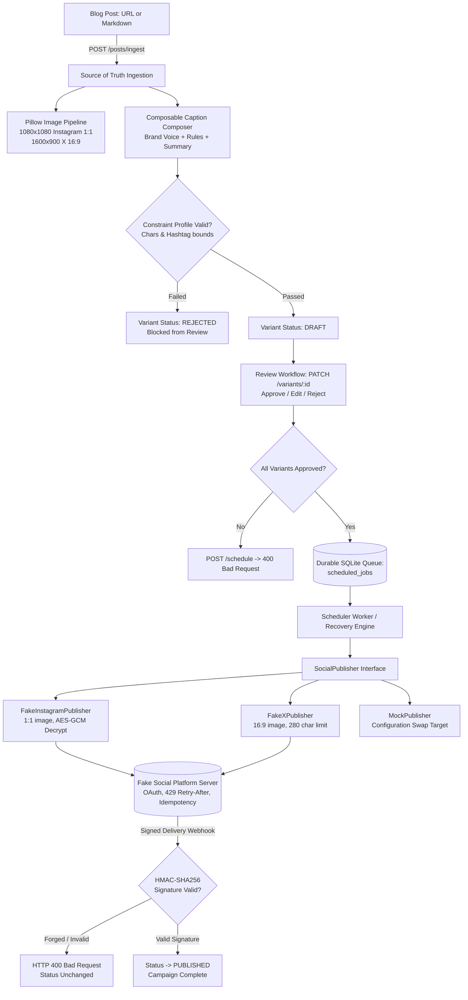

# Multi-Platform Social Campaign Publisher (Social Media Studio)

Production-grade, resilient social media campaign publishing engine that ingests blog posts, generates platform-tailored image variants ($1080\times1080$ Instagram, $1600\times900$ X) and composable captions, enforces strict constraint profiles, manages a review workflow (`draft` $\rightarrow$ `approved` $\rightarrow$ `published`), and orchestrates durable, idempotent publishing via an adapter architecture with AES-GCM encrypted tokens, rate-limit backoff handling, and HMAC signature-verified delivery webhooks.

Built for the **FlyRank Backend Internship Capstone** by **Deepak R**.

---

## 1. System Architecture



---

## 2. Core Capabilities

1. **Source-of-Truth Ingestion:** Ingests raw markdown or URL. All variant generation reads strictly from the stored blog post.
2. **Pillow Image Variant Pipeline:**
   - **Instagram:** $1080 \times 1080$ (1:1 square) with center-safe framing.
   - **X (Twitter):** $1600 \times 900$ (16:9 landscape) with center letterbox/crop.
   - Preserves aspect ratios and keeps content bounded inside safe zones.
3. **Constraint Profiles Enforced by Code:**
   - **Instagram:** Max 2,200 chars, 3–15 hashtags.
   - **X:** Max 280 chars, 1–3 hashtags.
   - Code validation rejects non-compliant variants *before* review.
4. **Strict Review Workflow:**
   - Statuses: `draft` $\rightarrow$ `approved` $\rightarrow$ `published` (or `rejected`).
   - Schedulers refuse unapproved variants with `HTTP 400 Bad Request`.
5. **Adapter Architecture & Dynamic Swapping:**
   - Applications interact only with `SocialPublisher`.
   - Adapters can be hot-swapped (e.g., Telegram $\rightarrow$ `mock_x`) via configuration with zero code changes outside adapters.
6. **Idempotent Publishing & Deduplication:**
   - Generates deterministic per-variant and slot idempotency keys (`idemp_<campaign_id>_<platform>_slot1`).
   - Network retries and duplicate clicks return cached results with zero duplicate posts.
7. **Rate-Limit Backoff (429 + Retry-After):**
   - On `HTTP 429`, parses `Retry-After`, logs a retry audit, and waits before retrying safely without hammering the API.
8. **Durable Crash Recovery:**
   - Scheduled jobs persist in SQLite.
   - If the worker crashes mid-batch, restarting it resumes from the interruption and finishes remaining variants with zero duplicates.
9. **AES-GCM Token Encryption at Rest:**
   - Tokens are stored encrypted with 256-bit AES-GCM and unique 96-bit random IVs.
   - Zero plaintext tokens in database records or logs.
10. **Cryptographically Verified Delivery Webhooks:**
    - Validates HMAC-SHA256 signatures (`X-Hub-Signature-256`) using constant-time comparison.
    - Rejects forged payloads with `HTTP 400`; only verified webhooks transition status to `published`.

---

## 3. Database Schema

- `blog_posts`: Single source of truth (`id`, `title`, `content`, `source_url`, `created_at`).
- `campaigns`: Campaign status lifecycle (`id`, `blog_post_id`, `status`, `scheduled_for`, `created_at`).
- `social_variants`: Platform-specific content (`id`, `campaign_id`, `platform`, `caption`, `image_path`, `status`, `rejection_reason`).
- `scheduled_jobs`: Persistent queue (`id`, `campaign_id`, `run_at`, `status`, `attempts`, `last_error`).
- `oauth_credentials`: AES-GCM encrypted tokens at rest (`id`, `platform`, `encrypted_token`, `nonce_hex`).
- `idempotency_records`: Request deduplication store (`id`, `idempotency_key`, `platform`, `external_post_id`, `response_body`).
- `publish_history`: Complete audit log of every publish attempt (`id`, `campaign_id`, `platform`, `status`, `external_post_id`, `post_url`, `timestamp`).

---

## 4. Quickstart & Verification

### Prerequisites
- Python 3.10+
- Virtual environment (recommended)

### Installation
```bash
git clone https://github.com/deepak007679/flyrank-capstone-social-studio.git
cd flyrank-capstone-social-studio
pip install -r requirements.txt
cp .env.example .env
```

### Run the Server
```bash
uvicorn main:app --host 0.0.0.0 --port 8000 --reload
```

### Run All 6 Acceptance Probes (Deterministic Automated Suite)
```bash
python tests/test_probes.py
```

Expected Output:
```text
==================================================================
  MULTI-PLATFORM SOCIAL STUDIO - ACCEPTANCE PROBE SUITE           
==================================================================
  [PASS] PROBE 1: Exactly-Once Publishing & Retries
  [PASS] PROBE 2: Rate-Limit Respect (429 + Retry-After Backoff)
  [PASS] PROBE 3: Durable Scheduling & Worker Crash Resumption
  [PASS] PROBE 4: Signature-Verified Webhooks (Forged -> 400)
  [PASS] PROBE 5: Artifact Dimensions & Caption Constraints
  [PASS] PROBE 6: Token Encryption at Rest & Adapter Swapping
------------------------------------------------------------------
Result: 6/6 Acceptance Probes Passed!
ALL PROBES VERIFIED SUCCESSFULLY.
```

---

## 5. API Reference

| Method | Endpoint | Description |
| :--- | :--- | :--- |
| `GET` | `/` | Root metadata, health check, and system guarantees |
| `POST` | `/seed` | Resets and seeds encrypted OAuth credentials and test blog post |
| `POST` | `/posts/ingest` | Ingests blog post and generates platform-specific image/caption variants |
| `GET` | `/campaigns/{id}` | Retrieves campaign status and associated variants |
| `PATCH` | `/variants/{id}` | Review endpoint: approve, edit caption, or reject variant |
| `POST` | `/campaigns/{id}/schedule` | Schedules an approved campaign for future publication |
| `POST` | `/scheduler/tick` | Evaluates and executes due scheduled jobs |
| `POST` | `/webhook/social-delivery` | Signature-verified webhook from social platform |
| `GET` | `/history` | Full publish history audit log |

---

## 6. Known Limitations & Production Roadmap

- **Database Engine:** Uses SQLite for local standalone zero-cost evaluation; production deployment targets PostgreSQL with row-level locks (`SELECT ... FOR UPDATE SKIP LOCKED`).
- **Distributed Queuing:** For multi-region worker fleets, Redis-backed BullMQ or Celery can replace SQLite scheduling.
- **Dynamic Brand Overlays:** The Pillow pipeline supports arbitrary logos and watermarks; future expansions include dynamic font rendering and automated caption translation.
